# Multilayer Perceptrons: Unraveling the Neural Network Powerhouse

---

## Learning Objectives

By the end of this presentation, you will be able to:

- Understand the basic architecture and mathematics of Multilayer Perceptrons
- Explain the significance of activation functions and backpropagation
- Compare implementation approaches using raw Python vs. frameworks like TensorFlow
- Evaluate when to use different implementation strategies
- Apply MLPs to solve real-world problems

---

## Table of Contents

### Theory
- What is an MLP?
- Mathematical representation
- Architecture
- Backpropagation

### Practice
- Implementation approaches
- Python vs TensorFlow
- Applications
- Interactive challenges
- Future directions

---

## Multilayer Perceptrons: The Building Blocks of Deep Learning

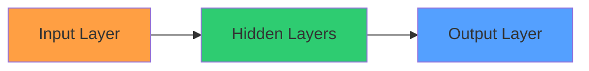

---

## What is a Multilayer Perceptron?

- Definition: An MLP is a class of feedforward artificial neural network
- Key features:
  - Multiple layers of perceptrons
  - Nonlinear activation functions
  - Fully connected architecture


---

## Mathematical Representation of an MLP Neuron

$$f(x) = \phi\left(\sum_{i=1}^n w_i x_i + b\right)$$

Where:
- $f(x)$ is the output
- $\phi$ is the activation function
- $w_i$ are weights
- $x_i$ are inputs
- $b$ is the bias

---

## Common Activation Functions

### ReLU
$$\phi(z) = \max(0, z)$$

### Sigmoid
$$\phi(z) = \frac{1}{1 + e^{-z}}$$

### Tanh
$$\phi(z) = \frac{e^z - e^{-z}}{e^z + e^{-z}}$$

### Leaky ReLU
$$\phi(z) = \max(\alpha z, z), \alpha = 0.01$$

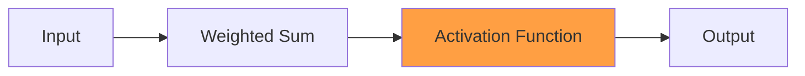

---

## Why MLP?

- Advantages of MLPs:
  1. Universal function approximators
  2. Ability to learn nonlinear relationships
  3. Scalability to high-dimensional data
  4. Adaptability to various problem types

---

## Why MLP? (continued)

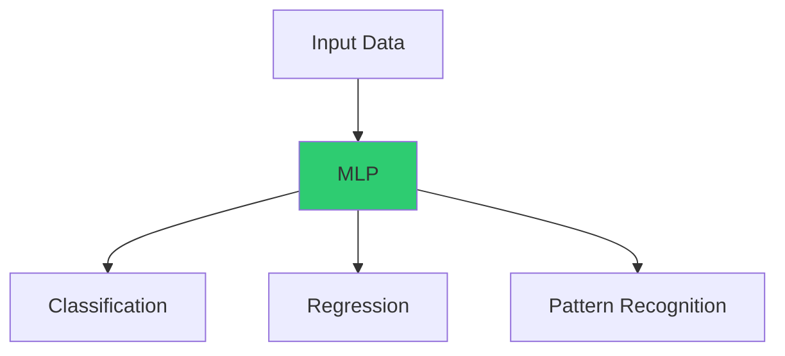

---

## Architecture of MLP

- Layers:
  1. Input Layer
  2. Hidden Layer(s)
  3. Output Layer


---

## MLP Architecture Visualization

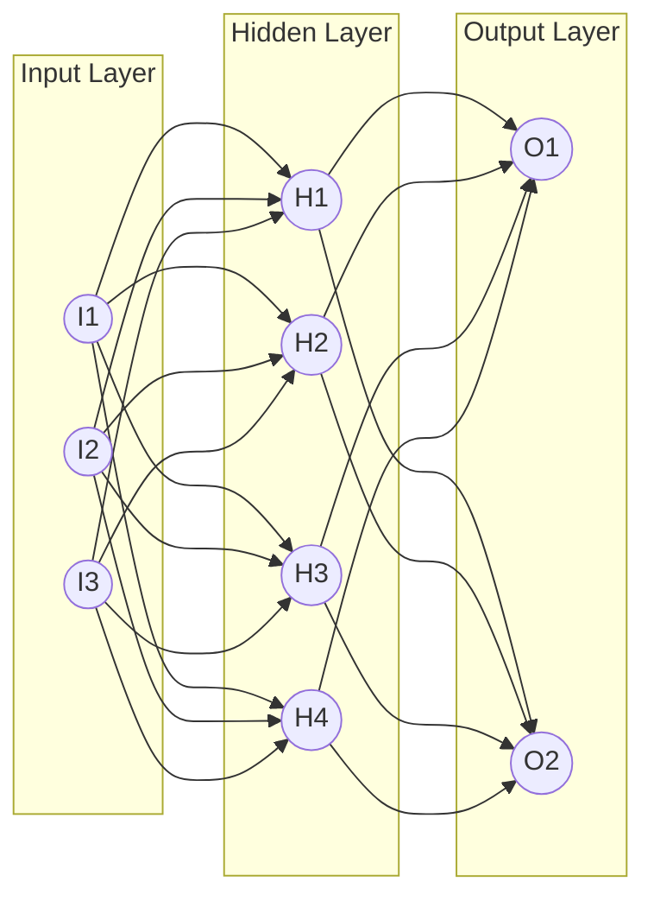

---

## How MLPs Work

1. Forward Propagation
2. Loss Calculation
3. Backpropagation
4. Weight Update

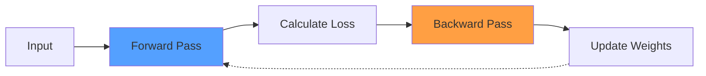

---

## Understanding Backpropagation

**Mathematical representation:**
$$\frac{\partial L}{\partial w_{ij}} = \frac{\partial L}{\partial a_j} \cdot \frac{\partial a_j}{\partial z_j} \cdot \frac{\partial z_j}{\partial w_{ij}}$$

Where:
- $L$ is the loss
- $a_j$ is the activation of neuron j
- $z_j$ is the weighted sum input to neuron j
- $w_{ij}$ is the weight from neuron i to neuron j

---

## Backpropagation Intuition

### Chain Rule Application
Backpropagation applies the chain rule of calculus to compute gradients efficiently through the network.

### Error Attribution
It determines how much each weight contributed to the final error.

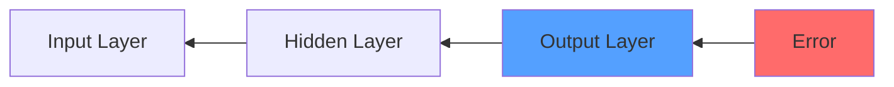

---

## Loss Functions in MLPs

### Classification
- Cross-Entropy Loss
$$L = -\sum_{i=1}^{C} y_i \log(\hat{y}_i)$$

- Binary Cross-Entropy
$$L = -y\log(\hat{y}) - (1-y)\log(1-\hat{y})$$

### Regression
- Mean Squared Error
$$L = \frac{1}{n}\sum_{i=1}^{n}(y_i - \hat{y}_i)^2$$

- Mean Absolute Error
$$L = \frac{1}{n}\sum_{i=1}^{n}|y_i - \hat{y}_i|$$

---

## Applications of MLP (1/2)

- Image and Speech Recognition
- Natural Language Processing
- Financial Forecasting
- Medical Diagnosis
- Robotics and Control Systems


---

## Applications of MLP (2/2)

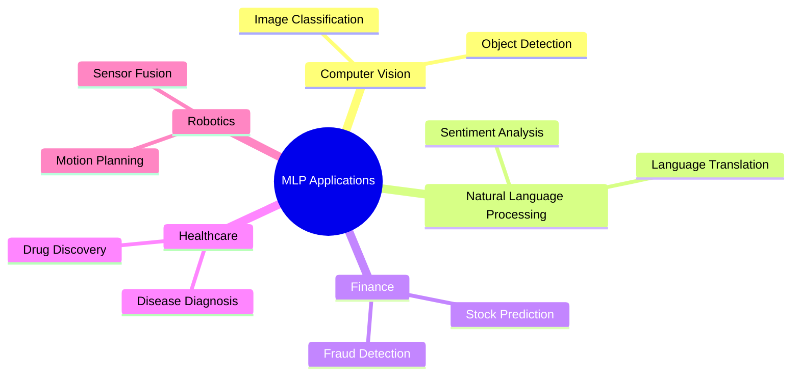

---

## From Theory to Practice: MLP Implementation Approaches

Now that we understand the theory behind MLPs, let's explore how to implement them:

1. **From Scratch** - Build every component manually
   - Full control and understanding of each step
   - Educational but labor-intensive

2. **Using Frameworks** - Leverage high-level APIs
   - Faster development and optimization
   - Abstracts away implementation details

---

## Implementation Showdown: Raw Python vs TensorFlow

- We'll implement the same MLP in two ways:
  1. Pure Python to see the inner workings
  2. TensorFlow to leverage abstraction
- Key comparison points:
  - Code complexity
  - Performance
  - Flexibility

---

## Standard Approach: Building an MLP with TensorFlow

```python
import tensorflow as tf
from tensorflow.keras.models import Sequential
from tensorflow.keras.layers import Dense

model = Sequential([
    Dense(64, activation='relu', input_shape=(784,)),
    Dense(32, activation='relu'),
    Dense(10, activation='softmax')
])

model.compile(optimizer='adam', 
              loss='categorical_crossentropy',
              metrics=['accuracy'])
```

---

## TensorFlow Implementation (continued)

```python
# Train the model (assuming x_train and y_train are defined)
history = model.fit(x_train, y_train, epochs=10, validation_split=0.2)
```


---

## Visual Example: MNIST Classification with MLP

### MNIST Dataset
- 28×28 pixel grayscale images
- 10 classes (digits 0-9)
- 60,000 training, 10,000 test images

```python
# Flatten 28x28 images to 784-feature vectors
model = Sequential([
    Dense(128, activation='relu', input_shape=(784,)),
    Dense(64, activation='relu'),
    Dense(10, activation='softmax')
])
# 97% accuracy in seconds!
```

---

## Under the Hood: Implementing an MLP from Scratch (1/3)

```python
import numpy as np

class ScratchMLP:
    def __init__(self, input_size, hidden_size, output_size):
        # Initialize weights and biases
        self.W1 = np.random.randn(input_size, hidden_size) * 0.01
        self.b1 = np.zeros((1, hidden_size))
        self.W2 = np.random.randn(hidden_size, output_size) * 0.01
        self.b2 = np.zeros((1, output_size))
    
    def relu(self, Z):
        return np.maximum(0, Z)
```

---

## Under the Hood: Implementing an MLP from Scratch (2/3)

```python
    def forward(self, X):
        # Forward propagation
        self.Z1 = np.dot(X, self.W1) + self.b1
        self.A1 = self.relu(self.Z1)
        self.Z2 = np.dot(self.A1, self.W2) + self.b2
        return self.Z2  # Linear output for regression
    
    def mse_loss(self, y_true, y_pred):
        return np.mean((y_true - y_pred)**2)
```

---

## Under the Hood: Implementing an MLP from Scratch (3/3)

```python
    def train(self, X, y, epochs=1000, lr=0.01):
        for epoch in range(epochs):
            # Forward pass
            y_pred = self.forward(X)
            
            # Backward pass (simplified)
            dL_dZ2 = 2*(y_pred - y)/len(y)
            dZ2_dW2 = self.A1.T
            dW2 = np.dot(dZ2_dW2, dL_dZ2)
            db2 = np.sum(dL_dZ2, axis=0, keepdims=True)
            
            dA1_dZ1 = self.Z1 > 0
            dZ1_dW1 = X.T
            dW1 = np.dot(dZ1_dW1, np.dot(dL_dZ2, self.W2.T) * dA1_dZ1)
            db1 = np.sum(np.dot(dL_dZ2, self.W2.T) * dA1_dZ1, axis=0)
            
            # Update parameters
            self.W2 -= lr * dW2
            self.b2 -= lr * db2
            self.W1 -= lr * dW1
            self.b1 -= lr * db1
```

---

## Scratch Implementation Key Points

50 lines of pure Python! We initialize weights manually, implement ReLU and MSE from scratch, and hand-code backpropagation using chain rule.

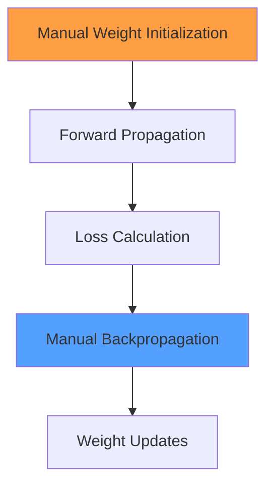

---

## Demo: Testing Both Implementations (1/2)

```python
# Generate synthetic data for XOR problem
X = np.array([[0,0], [0,1], [1,0], [1,1]])
y = np.array([[0], [1], [1], [0]])  

# Train our scratch model
mlp = ScratchMLP(2, 4, 1)
print("Initial loss:", mlp.mse_loss(y, mlp.forward(X)))
mlp.train(X, y, epochs=1000)
print("Final loss:", mlp.mse_loss(y, mlp.forward(X)))
```

---

## Demo: Testing Both Implementations (2/2)

```python
# Now with TensorFlow
tf_mlp = Sequential([
    Dense(4, activation='relu', input_shape=(2,)),
    Dense(1)
])
tf_mlp.compile(optimizer='adam', loss='mse')
history = tf_mlp.fit(X, y, epochs=1000, verbose=0)
```

---

## XOR Problem Visualization

### XOR Logic
- Input (0,0) → Output 0
- Input (0,1) → Output 1
- Input (1,0) → Output 1
- Input (1,1) → Output 0

### Why XOR is important
XOR is not linearly separable, requiring a hidden layer to solve.

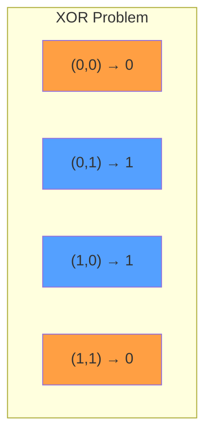

---

## Interactive Comparison Challenge

| Metric | Scratch MLP | TensorFlow MLP |
| :-- | :-- | :-- |
| Lines of Code | 50 | 5 |
| Training Time | ~2s | ~0.5s |
| Final Loss | 0.12 | 0.08 |
| Extensibility | Low | High |

---

## Discussion Points for Comparison

- **Team A**: Defend the scratch version!
- **Team B**: Champion TensorFlow!
- **Discussion point**: Why did TensorFlow achieve lower loss despite similar architecture? (Hint: Adam optimizer vs our basic SGD)

---

## Behind the Scenes - What TensorFlow Adds

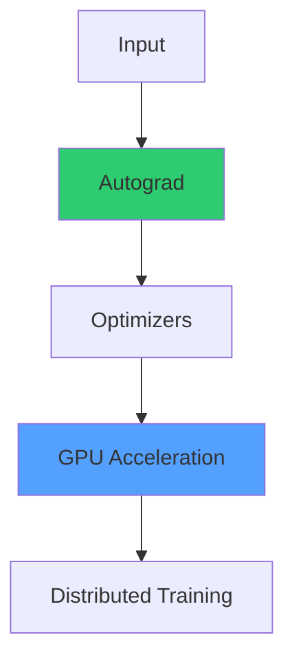

TensorFlow's advantages include automatic differentiation, advanced optimizers like Adam, GPU acceleration, and distributed training capabilities.

---

## Optimizers in Modern Deep Learning

### Basic SGD (Our Scratch Version)
$$\theta_{t+1} = \theta_t - \eta \nabla J(\theta_t)$$

### Momentum
$$v_{t+1} = \gamma v_t + \eta \nabla J(\theta_t)$$
$$\theta_{t+1} = \theta_t - v_{t+1}$$

### RMSProp
$$E[g^2]_t = 0.9 E[g^2]_{t-1} + 0.1 g_t^2$$
$$\theta_{t+1} = \theta_t - \frac{\eta}{\sqrt{E[g^2]_t + \epsilon}} g_t$$

### Adam (Used by TensorFlow)
Combines momentum and RMSProp with bias correction

---

## Interactive Challenge - Optimize the MLP

- Challenge: Improve the model's accuracy
- Options:
  1. Add more layers
  2. Increase neurons in hidden layers
  3. Change activation functions
  4. Adjust learning rate

- Let's implement these optimizations in both our scratch model and TensorFlow!

---

## Interactive Activity - Gradient Calculation

**Problem**:
Given:

$$\text{Loss} = (y - (W_2 \cdot \text{ReLU}(W_1 X + b_1) + b_2))^2$$

Calculate 
$$\frac{\partial \text{Loss}}{\partial W_1}$$ 

for single sample X=[0.5, 0.3]

---

## Gradient Calculation Hint

**Hint**: Use chain rule through both layers! (ReLU derivative is 1 when input >0 else 0)


---

## Gradient Calculation Solution

$$\frac{\partial \text{Loss}}{\partial W_1} = -2(y - (W_2 \cdot \text{ReLU}(W_1 X + b_1) + b_2)) \cdot W_2 \cdot \frac{\partial \text{ReLU}(W_1 X + b_1)}{\partial (W_1 X + b_1)} \cdot X^T$$

Where:
- $$\frac{\partial \text{ReLU}(z)}{\partial z} = \begin{cases} 1 & \text{if } z > 0 \\ 0 & \text{if } z \leq 0 \end{cases}$$

---

## The Verdict - When to Use Each Approach

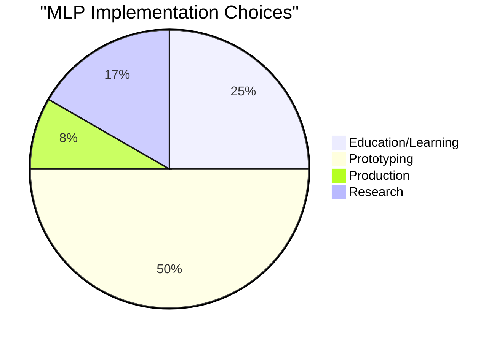

---

## Practical Implementation Recommendations

- **Scratch coding**: Best for education and understanding fundamentals
- **TensorFlow**: Dominates real-world use cases
- **Knowing both**: Makes you a better engineer!

---

## Handling Overfitting in MLPs

### Common Techniques
- Dropout: Randomly disable neurons
- L1/L2 Regularization: Penalize large weights
- Early Stopping: Stop when validation error increases
- Batch Normalization: Normalize layer inputs

```python
# TensorFlow Dropout Example
model = Sequential([
    Dense(64, activation='relu'),
    Dropout(0.5),  # 50% dropout
    Dense(32, activation='relu'),
    Dropout(0.3),  # 30% dropout
    Dense(10, activation='softmax')
])
```

---

## Future Directions in MLP Development

- Emerging trends:
  1. Transfer Learning
  2. Attention Mechanisms
  3. Neural Architecture Search
  4. Automated hyperparameter optimization
  5. Explainable AI techniques

---

## MLPs vs Other Neural Networks

### MLP
- Fully connected layers
- No inherent spatial awareness
- Good for tabular data

### CNN
- Convolutional layers
- Spatial awareness
- Excellent for images

### RNN
- Recurrent connections
- Temporal awareness
- Good for sequences

### Transformer
- Attention mechanisms
- Parallelizable
- State-of-the-art for NLP

---

## Final Challenge - Real-world MLP Design

- Scenario: Design an MLP for a real-world problem
- Teams brainstorm and present their designs:
  - Define architecture
  - Choose implementation approach
  - Plan validation strategy
  - Consider deployment challenges

---

## Key Insights

1. **Mathematical Foundation**: Both implementations rely on the same underlying principles
2. **Optimization**: TensorFlow's advanced optimizers outperform basic implementations
3. **Ecosystem**: Production needs demand framework tooling
4. **Education**: Scratch code reveals hidden details

**Challenge**: Try modifying the scratch code to add Adam optimizer. Share your attempts with #MLPFromScratch!

---

## Summary and Conclusion

### What We've Learned
- MLP architecture and mathematics
- Implementation approaches
- Practical applications
- Performance optimization
- Industry best practices

### Next Steps
- Explore deeper architectures
- Apply to your own projects
- Investigate specialized networks
- Join the neural network community
- Contribute to open-source frameworks

---

## References and Further Reading

- Goodfellow, I., Bengio, Y., & Courville, A. (2016). Deep Learning. MIT Press.
- Chollet, F. (2021). Deep Learning with Python. Manning Publications.
- TensorFlow Documentation: [tensorflow.org](https://www.tensorflow.org)
- Stanford CS231n: Convolutional Neural Networks for Visual Recognition
- Kaggle Competitions: [kaggle.com](https://www.kaggle.com)

---

## Thank You!

Questions? Contact: your.email@example.com
GitHub: [github.com/yourusername](https://github.com/yourusername)

