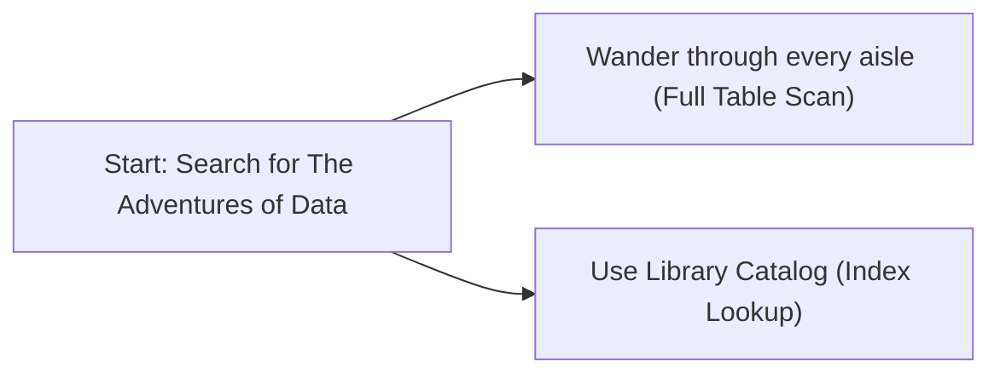
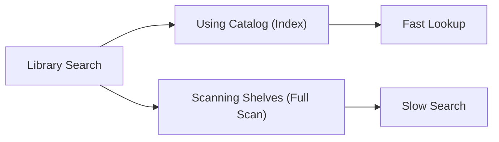
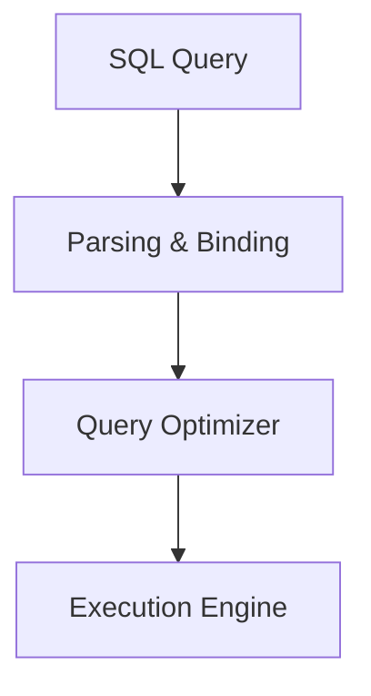
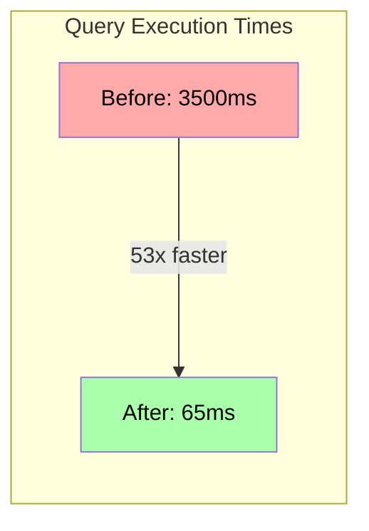
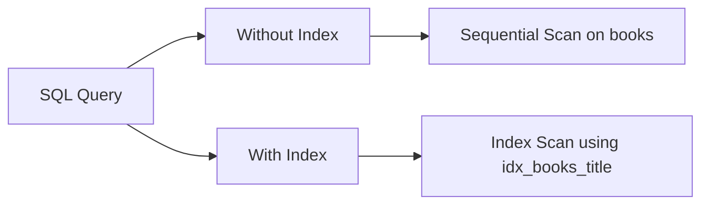

# Query Optimization: A Library Adventure
*Using Storytelling, Hands-On Activities, Math & Diagrams to Learn SQL Tuning*
**Marc Reyes**

---

## Introduction – Imagine a Massive Library

- *Imagine you're searching for a book in a **huge library** with millions of books...*  
- You need **"The Adventures of Data"** 📖. How will you find it?  
  - **Option 1:** Wander aisle by aisle (😫 slow!)  
  - **Option 2:** Use the library's **catalog** or ask a librarian (🚀 fast!)  
- **👉 Question:** *What would you do to find the book quickly?*



---

## The Library Analogy – Catalogs vs. Scanning Shelves

- **Library Catalog = Index:** Quickly finds books by title or author.  
- **Scanning Every Shelf = Full Table Scan:** Checks every book one by one.  
- A well‑indexed database is like a **well‑organized library**!  
- *Using the catalog gets you there fast; scanning shelves is a last resort.*



---

## What is Query Optimization?

- **Query Optimization:** Finding the fastest path to your data.  
- The **Query Optimizer** = the database's decision maker for search strategy.  
- It evaluates options (scan vs. index, join methods, etc.) and picks the lowest‑cost plan.  
- *Goal:* Retrieve results **quickly and efficiently** 🚀



---

## Database Query Optimization Landscape

- **Different Optimizers, Similar Principles:**
  - PostgreSQL: Cost-based optimizer with detailed statistics
  - MySQL: Hybrid rule/cost-based optimizer
  - Oracle: Advanced cost-based optimizer with adaptive plans
  - SQL Server: Cardinality estimation and statistics-driven
- **What they all share:** Finding the most efficient path to data

---

## Mathematical Modeling of Query Cost (1/2)

- **Sequential Scan Cost:**  
  $\text{Cost}_{\text{seq}} = N \times C_{\text{read}}$
  - $N$: Total rows, $C_{\text{read}}$: Cost per row read.
- **Index Scan Cost:**  
  $\text{Cost}_{\text{index}} = \log_2(N) \times C_{\text{read}} + R \times C_{\text{read}}$
  - $R$: Rows returned.

---

## Mathematical Modeling of Query Cost (2/2)

- **Nested Loop Join Cost:**  
  $\text{Cost}_{\text{NLJ}} = N_{\text{outer}} \times N_{\text{inner}} \times C_{\text{compare}}$
- **Hash Join Cost:**  
  $\text{Cost}_{\text{hash}} \approx N_{\text{build}} + N_{\text{probe}}$
- *These formulas help the optimizer decide which plan is cheaper.*

---

## Case Study – A Slow SQL Query (The Problem)

- **Scenario:** A `books` table with millions of records.  
- Query:  
  ```sql
  SELECT * 
  FROM books 
  WHERE title = 'The Hobbit';
  ```  
- **Question:** What happens when this runs on a huge table **without an index** on `title`?  
- **Answer:** **A full table scan**—it checks every row, which is painfully slow.

---

## Interactive Activity – Optimizing the Query (Brainstorm)

- **Your Turn:** How can we **speed up** this query?  
- Ideas to consider:  
  - **Add an index** on the `title` column.  
  - Avoid `SELECT *` if only certain columns are needed.  
  - Other strategies?  
- **Share your ideas!** *(Let's hear a few guesses.)*

---

## The Climax – Applying the Optimization (Index to the Rescue!)

- **Solution:** Create an index on the `title` column:  
  ```sql
  CREATE INDEX idx_books_title ON books(title);
  ```  
- Re-run the query:  
  ```sql
  SELECT * FROM books WHERE title = 'The Hobbit';
  ```  
- **Result:**  
  - **Before:** Full table scan (slow).  
  - **After:** Index seek (fast!).  
- *Performance improves dramatically!* 🚀

---

## Visual: Query Performance Before & After Optimization



*A typical database with millions of rows might see a 50x+ improvement!*

---

## Live Demo – Understanding the EXPLAIN Plan (Interactive)

- **Before Index:**  
  - Execution plan: "Seq Scan on books" (scanning all rows).  
- **After Index:**  
  - Execution plan: "Index Scan using idx_books_title" (direct lookup).  
- **Interactive:**  
  - Spot the difference: "Scan" vs. "Index"  
- The optimizer chose a new plan once the index was available!

---

## Live Demo – EXPLAIN Plan Diagram



---

## Real-World Query Optimization Impact

| Company | Before Optimization | After Optimization | Improvement |
|---------|---------------------|-------------------|-------------|
| E-commerce site | 8.2 seconds | 120 ms | 68x faster |
| Social media app | 12.5 seconds | 350 ms | 35x faster |
| Financial system | 45 seconds | 480 ms | 93x faster |

*Well-optimized queries save server resources, reduce costs, and improve user experience*

---

## Common Query Optimization Anti-Patterns

- **Using functions on indexed columns:**
  ```sql
  -- Bad: Can't use index
  SELECT * FROM users WHERE UPPER(email) = 'USER@EXAMPLE.COM';
  
  -- Good: Can use index
  SELECT * FROM users WHERE email = 'user@example.com';
  ```

- **Unnecessary subqueries and complex joins**
- **Missing statistics or outdated indexes**
- **Wildcard at beginning of LIKE pattern: `WHERE name LIKE '%Smith'`**

---

## Interactive Quiz: Spot the Optimized Query

Which query would execute faster?

**Query A:**
```sql
SELECT * FROM customers 
WHERE last_name LIKE '%son%'
ORDER BY created_at;
```

**Query B:**
```sql
SELECT customer_id, first_name, last_name 
FROM customers 
WHERE customer_id BETWEEN 1000 AND 2000
ORDER BY customer_id;
```

*(Hint: Think about indexes and selectivity)*

---

## Key Takeaways – Tips for Query Optimization

- **Index Smartly:**  
  - Use indexes on columns frequently searched or joined.  
- **Be Selective:**  
  - Avoid `SELECT *`; fetch only needed columns.  
- **Analyze with EXPLAIN:**  
  - Understand and improve your query plans.  
- **Think Like the Optimizer:**  
  - Use cost estimates (like our formulas) to guide improvements.  
- *Balance is key:* Too many indexes can hurt write performance.

---

## Optimization Strategies Beyond Indexing

- **Partitioning large tables** by date, region, or category
- **Materialized views** for complex aggregations
- **Query parameterization** to leverage plan caching
- **Using appropriate join types** (nested loop, hash, merge)
- **Data denormalization** for read-heavy scenarios
- **Query rewriting** to simplify complex logic

---

## Conclusion – The End of the Story

- **Recap:**  
  - We transformed a slow query (wandering the library) into a fast one (using a catalog).  
  - We applied math and practical tools to optimize performance.  
- **Moral:**  
  - Treat your database like a library—stay organized and use available tools.  
- **Engage:**  
  - Any questions or experiences to share?  
- **Thank You & Happy Querying!** 🙌📊

---

## Resources to Learn More

- **Books**:
  - "SQL Performance Explained" by Markus Winand
  - "High Performance MySQL" by Schwartz, Zaitsev & Tkachenko
  
- **Online Tools**:
  - [EXPLAIN.DEPESZ.COM](https://explain.depesz.com/) - PostgreSQL EXPLAIN visualizer
  - [Use The Index, Luke!](https://use-the-index-luke.com/) - SQL indexing tutorials
  
- **Documentation**:
  - Your DB's optimization guide (PostgreSQL, MySQL, etc.)
  - Query Plan analysis documentation