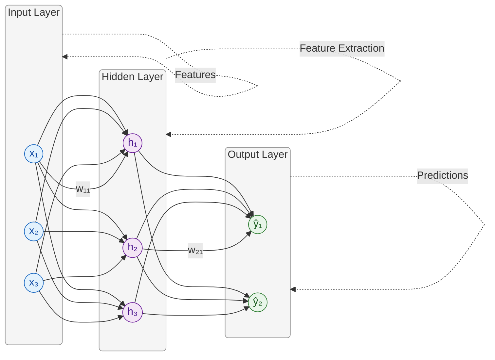
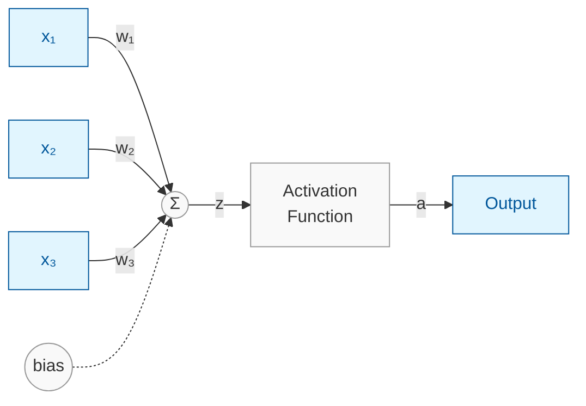
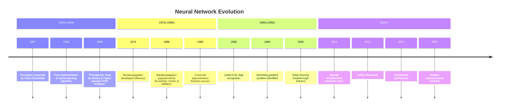
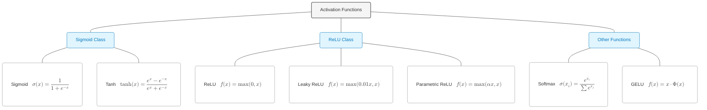
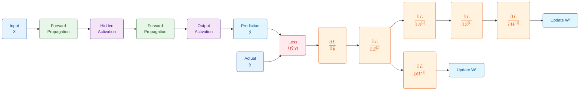
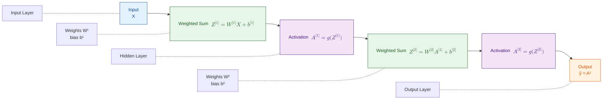
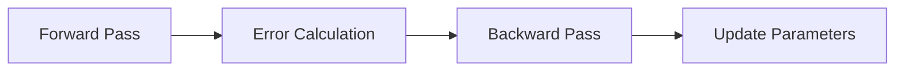
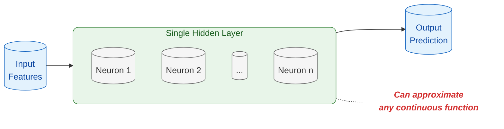

<!-- KaTeX and Mermaid Math Configuration -->

# Multilayer Perceptron (MLP)

## Neural Network Fundamentals

### A Comprehensive Introduction

**Marc Reyes**
*Lecturer*
*March 7, 2025*

---

# The Building Blocks of Deep Learning

<!--
Slide 1-2: The Building Blocks of Deep Learning
1. Define Multilayer Perceptrons (MLPs):
- Start by defining what an MLP is: a class of artificial neural networks composed of multiple layers of neurons, where each neuron is connected to every neuron in the next layer (fully connected).
- Explain that MLPs are foundational architectures in deep learning and are used for supervised learning tasks such as classification and regression.
- Mention that MLPs are considered "universal function approximators," meaning they can theoretically model any continuous function given enough neurons and data.
2. Why MLPs Matter:
- Highlight their importance as the building blocks of modern neural networks.
- Explain that while more advanced architectures like Convolutional Neural Networks (CNNs) or Transformers exist, the principles learned from MLPs apply to all neural networks.
- Emphasize that understanding MLPs is critical for grasping more complex models.
3) Connect to Broader Deep Learning Landscape:
- Briefly introduce how MLPs evolved into deeper architectures (e.g., CNNs for image data, RNNs for sequential data).
- Mention that MLPs are still widely used in simpler tasks or as components within larger architectures.
-->

---
<!--
Slide 1-2: The Building Blocks of Deep Learning
1. Define Multilayer Perceptrons (MLPs):
- Start by defining what an MLP is: a class of artificial neural networks composed of multiple layers of neurons, where each neuron is connected to every neuron in the next layer (fully connected).
- Explain that MLPs are foundational architectures in deep learning and are used for supervised learning tasks such as classification and regression.
- Mention that MLPs are considered "universal function approximators," meaning they can theoretically model any continuous function given enough neurons and data.
2. Why MLPs Matter:
- Highlight their importance as the building blocks of modern neural networks.
- Explain that while more advanced architectures like Convolutional Neural Networks (CNNs) or Transformers exist, the principles learned from MLPs apply to all neural networks.
- Emphasize that understanding MLPs is critical for grasping more complex models.
3) Connect to Broader Deep Learning Landscape:
- Briefly introduce how MLPs evolved into deeper architectures (e.g., CNNs for image data, RNNs for sequential data).
- Mention that MLPs are still widely used in simpler tasks or as components within larger architectures.
-->

# The Building Blocks of Deep Learning

- Foundation of modern neural networks
- Versatile architecture for diverse problems
- Combines simplicity with powerful learning capabilities

---
<!-- 
Slide 3-4: From Neurons to Networks
1. Biological Inspiration:
- Begin by explaining how artificial neural networks were inspired by the structure and functioning of biological neurons in the human brain.
- Use an analogy: dendrites receive signals (inputs), the cell body processes them, and the axon sends output signals. Similarly, artificial neurons take inputs, process them using weights and biases, and produce outputs.
2. Artificial Neuron Components:
- Inputs (x1,x2,..,xn): These represent features or data points fed into the network.
- Weights (w1,w2,...,wn): These determine the importance of each input. Larger weights amplify certain inputs more than others.
- Summation Function (Σ): Computes a weighted sum of inputs: z=∑(wi⋅xi)+b, where b is the bias term.
- Bias (b): A constant added to shift the activation function's output, allowing more flexibility in learning.
- Activation Function (g(z)): Introduces non-linearity to enable the network to learn complex patterns.
3. Network Structure:
- Input Layer: The first layer where raw data enters (e.g., pixel values for images).
- Hidden Layers: Intermediate layers where feature extraction occurs. Each layer learns increasingly abstract representations of the data.
- Output Layer: The final layer producing predictions or classifications (e.g., probabilities for classes).
-->

# From Neurons to Networks

---
<!-- 
Slide 3-4: From Neurons to Networks
1. Biological Inspiration:
- Begin by explaining how artificial neural networks were inspired by the structure and functioning of biological neurons in the human brain.
- Use an analogy: dendrites receive signals (inputs), the cell body processes them, and the axon sends output signals. Similarly, artificial neurons take inputs, process them using weights and biases, and produce outputs.
2. Artificial Neuron Components:
- Inputs (x1,x2,..,xn): These represent features or data points fed into the network.
- Weights (w1,w2,...,wn): These determine the importance of each input. Larger weights amplify certain inputs more than others.
- Summation Function (Σ): Computes a weighted sum of inputs: z=∑(wi⋅xi)+b, where b is the bias term.
- Bias (b): A constant added to shift the activation function's output, allowing more flexibility in learning.
- Activation Function (g(z)): Introduces non-linearity to enable the network to learn complex patterns.
3. Network Structure:
- Input Layer: The first layer where raw data enters (e.g., pixel values for images).
- Hidden Layers: Intermediate layers where feature extraction occurs. Each layer learns increasingly abstract representations of the data.
- Output Layer: The final layer producing predictions or classifications (e.g., probabilities for classes).
-->

# From Neurons to Networks

- **Biological inspiration**: Mimics brain's neural structure
  - Neurons receive, process, and transmit information
- **Artificial neuron**: Weighted sum + activation function
  - Processes inputs through mathematical operations
- **Network topology**: Input layer → Hidden layers → Output layer
  - Organized structure for information processing
- **Information flow**: Forward propagation for predictions
  - Data travels from input to output through the network

---
<!--
Slide 5: The Perceptron Journey
1. Historical Development Timeline:
- 1958: Frank Rosenblatt introduced the perceptron model, a single-layer neural network capable of solving linearly separable problems (e.g., AND, OR).
- 1969: Marvin Minsky and Seymour Papert demonstrated that single-layer perceptrons could not solve non-linearly separable problems like XOR. - This led to reduced interest in neural networks for over a decade.
- 1986: The backpropagation algorithm was introduced by Rumelhart, Hinton, and Williams, enabling multi-layer networks to learn efficiently by adjusting weights through gradient descent.
2. Significance of Milestones:
- Explain how backpropagation addressed the limitations of single-layer perceptrons by enabling multi-layer networks to learn complex patterns.
- Highlight how these advancements laid the foundation for modern deep learning architectures.
-->

# The Perceptron Journey

<!-- Replace image with a timeline/gantt chart diagram -->

- **1958**: Rosenblatt's single-layer perceptron
  - First implementation of a neural learning algorithm
- **1969**: Minsky & Papert expose limitations (XOR problem)
  - Demonstrated that single-layer networks couldn't solve nonlinear problems
- **1986**: Rumelhart, Hinton & Williams introduce backpropagation
  - Breakthrough algorithm enabling training of multi-layer networks
- **Today**: Foundation for advanced architectures (CNNs, RNNs, Transformers)
  - Core concepts extended to specialized network designs

---
<!--
Slide 6-7: MLP Architecture (Key Components)
1. Layered Structure Visualization:
- Show a diagram of an MLP with input, hidden, and output layers.
- Explain how each layer transforms data:
  - Input Layer: Takes raw data as input features (e.g., pixel intensities for images).
  - Hidden Layers: Perform feature extraction by applying weights, biases, and activation functions.
  - Output Layer: Produces predictions or classifications based on transformed features.
2. Information Flow Through Layers:
- Describe forward propagation as the process where data flows from input to output through successive layers.
- Emphasize how each hidden layer learns intermediate representations of the input data.
3. Feature Hierarchy Development:
- Explain that earlier layers learn simple patterns (e.g., edges in images), while deeper layers learn more abstract features (e.g., shapes or objects).
-->

# MLP Architecture

---
<!--
Slide 6-7: MLP Architecture (Key Components)
1. Layered Structure Visualization:
- Show a diagram of an MLP with input, hidden, and output layers.
- Explain how each layer transforms data:
  - Input Layer: Takes raw data as input features (e.g., pixel intensities for images).
  - Hidden Layers: Perform feature extraction by applying weights, biases, and activation functions.
  - Output Layer: Produces predictions or classifications based on transformed features.
2. Information Flow Through Layers:
- Describe forward propagation as the process where data flows from input to output through successive layers.
- Emphasize how each hidden layer learns intermediate representations of the input data.
3. Feature Hierarchy Development:
- Explain that earlier layers learn simple patterns (e.g., edges in images), while deeper layers learn more abstract features (e.g., shapes or objects).
-->

## Key Components

- **Input layer**: Raw data reception
  - Receives and standardizes input features
- **Hidden layers**: Feature extraction and transformation
  - Learns hierarchical representations of data
- **Output layer**: Final prediction/classification
  - Produces the network's answer to the given problem

---
<!--
Slide 8-9: MLP Architecture (Key Components Continued)
1. Learnable Parameters (Weights and Biases):
- Weights determine how much influence each input has on a neuron’s output.
- Biases allow neurons to shift activation thresholds, adding flexibility to learning.
- Explain that these parameters are adjusted during training to minimize error.
2) Role of Activation Functions:
- Activation functions introduce non-linearity into the network, enabling it to learn complex patterns beyond linear relationships.
- Without activation functions, no matter how many layers exist, the network would behave like a linear model.
-->

# MLP Architecture

---
<!--
Slide 8-9: MLP Architecture (Key Components Continued)
1. Learnable Parameters (Weights and Biases):
- Weights determine how much influence each input has on a neuron’s output.
- Biases allow neurons to shift activation thresholds, adding flexibility to learning.
- Explain that these parameters are adjusted during training to minimize error.
2) Role of Activation Functions:
- Activation functions introduce non-linearity into the network, enabling it to learn complex patterns beyond linear relationships.
- Without activation functions, no matter how many layers exist, the network would behave like a linear model.
-->

## Key Components

- **Weights & biases**: Learnable parameters
  - Adjusted during training to minimize error
- **Activation functions**: Introduce non-linearity
  - Enable the network to learn complex patterns

---
<!--
Slide 10-11: Activation Functions
1. Sigmoid Function (σ(z)):
- Formula: σ(z)=1/(1+e)^−z
- Output Range: (0, 1)
- Use Case: Binary classification tasks where outputs represent probabilities.
- Limitation: Vanishing gradient problem—gradients become very small for large positive or negative inputs, slowing down training.
2. Tanh Function (tanh(z)):
- Formula: tanh(z)=(e^z−e^−z)/(e^z+e^−z)
- Output Range: (-1, 1)
- Advantage over Sigmoid: Zero-centered outputs help gradients flow better during training.
3. ReLU (Rectified Linear Unit):
- Formula: ReLU(z)=max(0,z)
- Advantage: Efficient computation and mitigates vanishing gradients.
-->

# Activation Functions

| Function      | Formula                                               | Characteristics                     |
|---------------|-------------------------------------------------------|-------------------------------------|
| Sigmoid       | $\sigma(x) = \frac{1}{1+e^{-x}}$                       | Output range [0,1], vanishing gradient |
| Tanh          | $\tanh(x) = \frac{e^x-e^{-x}}{e^x+e^{-x}}$             | Output range [-1,1], zero-centered    |

---
<!--
Slide 10-11: Activation Functions
1. Sigmoid Function (σ(z)):
- Formula: σ(z)=1/(1+e)^−z
- Output Range: (0, 1)
- Use Case: Binary classification tasks where outputs represent probabilities.
- Limitation: Vanishing gradient problem—gradients become very small for large positive or negative inputs, slowing down training.
2. Tanh Function (tanh(z)):
- Formula: tanh(z)=(e^z−e^−z)/(e^z+e^−z)
- Output Range: (-1, 1)
- Advantage over Sigmoid: Zero-centered outputs help gradients flow better during training.
3. ReLU (Rectified Linear Unit):
- Formula: ReLU(z)=max(0,z)
- Advantage: Efficient computation and mitigates vanishing gradients.
-->
# Activation Functions

| Function      | Formula                                               | Characteristics                          |
|---------------|-------------------------------------------------------|------------------------------------------|
| ReLU          | $f(x) = \max(0,x)$                                    | Computationally efficient, sparse activation |
| Leaky ReLU    | $f(x) = \max(0.01x, x)$                                | Prevents dying ReLU problem              |

---
<!-- 
Slide 12: Forward Propagation (Part 1)
1. Mathematical Representation:
- Explain the formula for forward propagation: Z[l]=W[l]A[l−1]+b[l]\
  - Z [l]: Weighted sum of inputs at layer l
  - W [l]: Weight matrix for layer l
  - A[l−1] : Activations from the previous layer.
  - b[l] : Bias vector for layer l
- Highlight that A represents the input data.
Linear Transformation:
- Explain how the network computes a weighted sum of inputs and biases for each neuron in a layer.
- Use a simple example with small matrices to demonstrate how inputs are multiplied by weights, summed, and biases are added.
-->

# Forward Propagation

For each layer $l$:

$$Z^{[l]} = W^{[l]} \cdot A^{[l-1]} + b^{[l]}$$
$$A^{[l]} = g^{[l]}(Z^{[l]})$$

Where:

- $W^{[l]}$ = weights matrix
- $b^{[l]}$ = bias vector

---
<!--
Slide 13: Forward Propagation (Part 2)
1. Activation Function Application:
- After computing Z[l], apply the activation function  g(z) to produce A[l] (activations for layer l).
- Formula: A[l]=g(Z[l])), where g could be sigmoid, tanh, or ReLU depending on the task.
2. Information Flow Through Layers:
- Describe how activations from one layer become inputs to the next layer.
- Emphasize that forward propagation transforms raw input data into increasingly abstract representations as it moves through layers.
3. Final Output:
- Explain that the output layer produces predictions (e.g., probabilities for classification tasks or numerical values for regression tasks).
-->
# Forward Propagation

Where:

- $g^{[l]}$ = activation function
- $A^{[l]}$ = activation output

---
<!--
Slide 14: Backpropagation: Learning Process (Part 1)
1. Forward Pass Recap:
- Briefly recap that forward propagation generates predictions based on current weights and biases.
2. Error Calculation Using Loss Function:
- Introduce loss functions as measures of how far predictions are from actual values.
  - Example for regression: Mean Squared Error (MSE).
  - Example for classification: Cross-Entropy Loss.
3. Goal of Backpropagation:
- Explain that backpropagation adjusts network parameters (weights and biases) to minimize this loss.
-->
# Backpropagation: Learning Process

1. **Forward pass**: Compute predictions
   - Process inputs through the network
2. **Error calculation**: Compare with ground truth

---
<!--
Slide 15: Backpropagation: Learning Process (Part 2)
1. Gradient Calculation Using Chain Rule:
- Explain how gradients of the loss function with respect to weights and biases are computed using the chain rule of calculus.
- Highlight that gradients measure how much each parameter contributes to the error.
2. Parameter Updates Using Gradient Descent:
- Introduce gradient descent as an optimization algorithm:
  - Formula for weight update: W[l]=W[l]−α∂L∂W[l]
  - Formula for bias update: b[l]=b[l]−α∂L∂b[l]
  - α is the learning rate, controlling step size during updates.
3. Iterative Process:
- Emphasize that backpropagation is repeated over many epochs until the loss converges or stops improving.
-->

# Backpropagation: Learning Process

3. **Backward pass**: Compute gradients
4. **Parameter update**: Adjust weights and biases

$$W^{[l]} = W^{[l]} - \alpha \frac{\partial J}{\partial W^{[l]}}$$
$$b^{[l]} = b^{[l]} - \alpha \frac{\partial J}{\partial b^{[l]}}$$

---
<!--
Slide 16: Loss Functions (Part 1)
1. Mean Squared Error (MSE):
- Use Case: Regression tasks where outputs are continuous values.
- Explain that MSE penalizes larger errors more heavily than smaller ones.
2. Binary Cross-Entropy Loss:
- Use Case: Binary classification tasks where outputs represent probabilities.
- Highlight its connection to probability theory and maximum likelihood estimation.
-->
# Loss Functions

| Task                     | Loss Function         | Formula |
|--------------------------|-----------------------|---------|
| Regression               | Mean Squared Error    | $\frac{1}{n}\sum_{i=1}^{n}(y_i - \hat{y}_i)^2$ |
| Binary Classification    | Binary Cross-Entropy  | $-\frac{1}{n}\sum_{i=1}^{n}[y_i\log(\hat{y}_i) + (1-y_i)\log(1-\hat{y}_i)]$ |

---
<!--
Slide 17: Loss Functions (Part 2)
1. Categorical Cross-Entropy Loss (CCE):
- Formula for multi-class classification tasks:
  - where: yij is a one-hot encoded label indicating class membership.
  - y^ij is the predicted probability for class 
- Explain its use in problems with multiple classes.
2. Loss Function Selection Criteria:
- Discuss how different loss functions are suited to different types of problems:
  - Regression → MSE
  - Binary Classification → Binary Cross-Entropy
  - Multi-Class Classification → CCE
-->

# Loss Functions

| Task                         | Loss Function             | Formula |
|------------------------------|---------------------------|---------|
| Multi-class Classification   | Categorical Cross-Entropy | $-\frac{1}{n}\sum_{i=1}^{n}\sum_{j=1}^{m}y_{ij}\log(\hat{y}_{ij})$ |

- Loss guides the learning process
- Different tasks use specialized error measurements
- Optimization aims to minimize loss

---
<!--
Slide 18-19: Universal Approximation Theorem
1. Theorem Statement and Intuition:
- State the theorem simply: "An MLP with one hidden layer can approximate any continuous function given enough neurons."
- Use an analogy:
  - Imagine building complex shapes using small building blocks—MLPs combine simple components to model intricate patterns.
2. Mathematical Foundation (Optional):
- Mention that this theorem relies on activation functions like sigmoid or ReLU being non-linear and continuous.
3. Practical Implications of the Theorem:
- While theoretically one hidden layer suffices, practically deep networks with multiple layers are preferred because they require fewer neurons per layer and can learn hierarchical features efficiently.
-->

# Universal Approximation Theorem

---

# Universal Approximation Theorem

> "A feedforward network with a single hidden layer containing a finite number of neurons can approximate any continuous function, under mild assumptions on the activation function."

- The theoretical foundation for MLP capabilities

---
<!--
Slide 18-19: Universal Approximation Theorem
1. Theorem Statement and Intuition:
- State the theorem simply: "An MLP with one hidden layer can approximate any continuous function given enough neurons."
- Use an analogy:
  - Imagine building complex shapes using small building blocks—MLPs combine simple components to model intricate patterns.
2. Mathematical Foundation (Optional):
- Mention that this theorem relies on activation functions like sigmoid or ReLU being non-linear and continuous.
3. Practical Implications of the Theorem:
- While theoretically one hidden layer suffices, practically deep networks with multiple layers are preferred because they require fewer neurons per layer and can learn hierarchical features efficiently.
-->

# Universal Approximation Theorem

- More complex functions may require more neurons
- Practical implementations must balance capacity and training challenges

---
<!--
Slide 20: Universal Approximation Theorem (Continued)
1. Trade-Offs Between Depth and Width in Networks:
- Explain why deeper networks are more practical than wider networks:
  - Depth allows hierarchical feature representation (e.g., edges → shapes → objects in images).
  - Wide networks require exponentially more neurons to achieve similar results.
2. Limitations of Shallow Networks in Practice:
- Discuss challenges such as computational inefficiency and difficulty in learning complex patterns with shallow architectures.
-->

# Visualizing Decision Boundaries

- **Linear boundaries**: Single-layer perceptrons
  - Separate data with straight lines
- **Non-linear boundaries**: MLPs with hidden layers
  - Can form complex separation surfaces

---
<!--
Slide 21: Single-Layer Perceptron Decision Boundaries
1. Single-Layer Perceptron Limitations:
- Explain that single-layer perceptrons can only solve problems where data points are linearly separable.
- Use a visual example of linearly separable data (e.g., AND/OR gates).
- Introduce the XOR problem as a classic example of non-linearly separable data, which single-layer perceptrons cannot solve.
2. Why MLPs Are Needed:
- Explain that adding hidden layers allows networks to learn non-linear decision boundaries.
- Emphasize that MLPs can solve problems like XOR by transforming the input space into one where linear separation is possible.
-->
# Visualizing Decision Boundaries

- **Complexity increases** with deeper architectures
- Explore an interactive demo at [perceptron.marcr.xyz](https://perceptron.marcr.xyz)

---
<!--
Slide 22: MLP Decision Boundaries
1. Non-Linear Decision Boundaries:
- Use visuals to show how MLPs with hidden layers create more complex decision boundaries.
- Explain that each hidden layer applies transformations to the input space, enabling the network to separate data points in ways single-layer perceptrons cannot.
2. Role of Depth in Decision Boundaries:
- Highlight that deeper networks (more hidden layers) can model increasingly intricate patterns.
- Show examples of decision boundaries evolving from simple (shallow networks) to complex (deep networks).
3. Interactive Demonstration:
- If possible, provide or reference an interactive tool (e.g., TensorFlow Playground) where students can visualize how decision boundaries change as layers and neurons are added.
-->
# Quick Quiz: Test Your Knowledge

## Which of these problems can a single-layer perceptron solve?

A) XOR problem
B) Linear classification
C) Image recognition
D) All of the above

*Use the poll feature to submit your answer!*

---
<!--
Slide 23: Quick Quiz: Test Your Knowledge
1. Interactive Question:
- Present a question such as:
  - "Which type of problem can a single-layer perceptron NOT solve?"
   - A) XOR problem
   - B) Linear classification
   - C) Image recognition
2. Answer Explanation:
- Correct Answer: A) XOR problem.
  - Explain that single-layer perceptrons can only create linear decision boundaries, which are insufficient for solving non-linear problems like XOR.
- Option B (Linear Classification): Explain why single-layer perceptrons can handle linearly separable tasks like AND/OR gates.
- Option C (Image Recognition): Explain that image recognition is far too complex for a single-layer perceptron because it requires hierarchical feature extraction, which only deeper networks can achieve.
3. Purpose of the Quiz:
- Reinforce understanding of MLP capabilities and limitations.
- Encourage active participation and discussion.
4. Understanding Mathematical Foundations:
- Discuss common difficulties students face when learning about MLPs:
  - Grasping matrix operations in forward/backpropagation.
  - Understanding how gradients are computed using the chain rule.
- Suggest resources like online tutorials, videos, or textbooks for review.
5. Choosing Network Architecture:
- Explain how to decide on:
  - Number of hidden layers and neurons per layer.
  - Appropriate activation functions for each layer.
  - Learning rate and other hyperparameters.
- Mention that trial-and-error combined with validation data is often necessary.
6. Overfitting and Underfitting:
- Define overfitting (model memorizes training data but fails on unseen data).
- Define underfitting (model is too simple to capture underlying patterns).
- Solutions:
- Regularization techniques (e.g., L1/L2 regularization, dropout). 
 - Increasing training data or simplifying the model.
7. Computational Resources:
- Discuss hardware requirements for training deep networks:
  - GPUs/TPUs for faster computation.
  - Cloud-based platforms like Google Colab or AWS for scalability.
- Mention trade-offs between computational cost and model complexity.
8. Interpreting Results and Debugging:
- Explain common evaluation metrics (e.g., accuracy, precision/recall, F1-score).
- Discuss debugging strategies:
- Checking gradients during backpropagation.
 - Visualizing activations and decision boundaries.
-->
# Practical Implementation Challenges

## What's your biggest challenge with neural networks?

- Understanding the math
- Choosing the right architecture
- Overfitting/underfitting
- Computational resources
- Interpreting results

*Share your thoughts!*

---
<!--
Slide 25: Thank You, Contact Information, and Resources
1. Summarize Key Takeaways:
- Recap the main points covered in the lecture:
 - MLPs are foundational architectures in deep learning.
 - They consist of input, hidden, and output layers connected by weights and biases.
 - Activation functions introduce non-linearity, enabling MLPs to learn complex patterns.
 - Backpropagation is the key algorithm for training MLPs by minimizing a loss function through gradient descent.
2. Encourage Further Exploration:
- Recommend topics for deeper learning:
 - Advanced architectures like CNNs, RNNs, and Transformers.
 - Optimization techniques beyond gradient descent (e.g., Adam optimizer).
 - Regularization methods to improve generalization.
3. Provide Resources for Practice:
- Suggest hands-on tools like TensorFlow Playground or PyTorch tutorials for implementing MLPs from scratch.
- Share links to datasets or challenges (e.g., Kaggle competitions) where students can apply their knowledge.

-->
# Thank You

## Contact Information

- Email: [hi@marcr.xyz](mailto:hi@marcr.xyz)

## Resources

- Interactive Demo: [perceptron.marcr.xyz](https://perceptron.marcr.xyz)
- Slides: [github.com/mabreyes/dlsu-lecture-slides](https://github.com/mabreyes/dlsu-lecture-slides)
