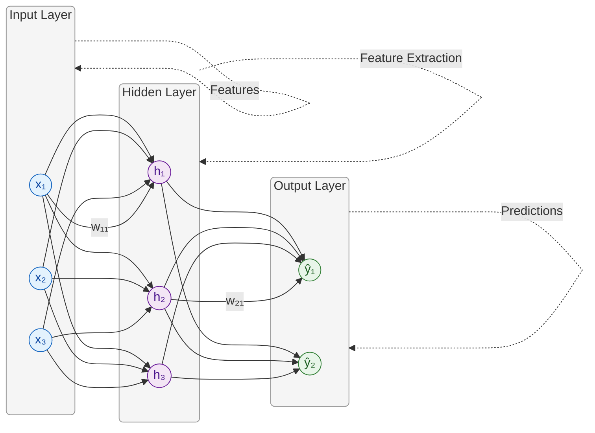
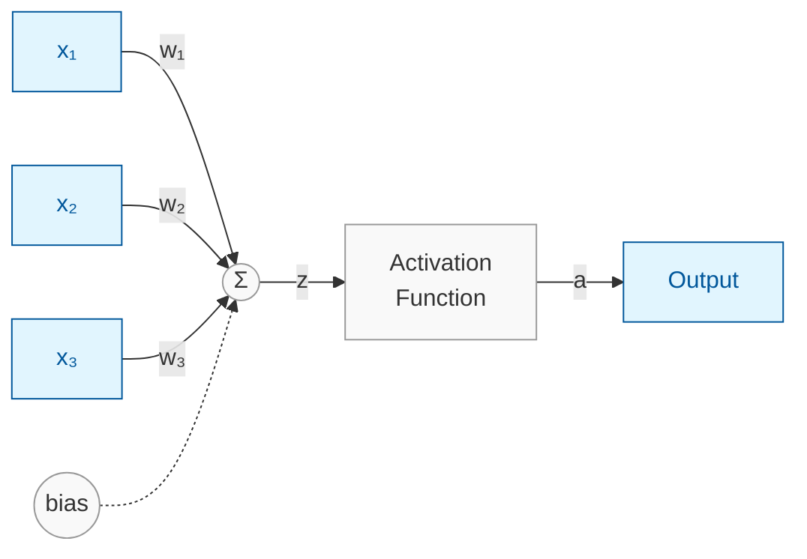
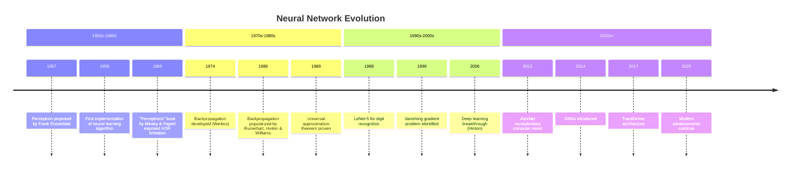
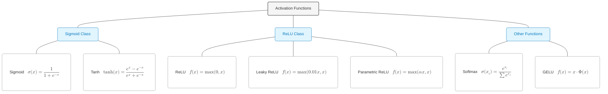
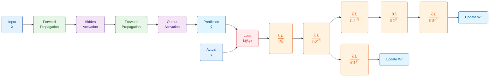
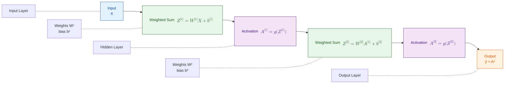
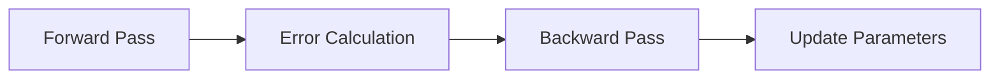
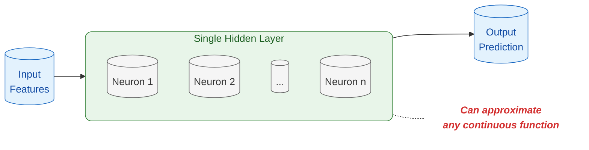

<!-- KaTeX and Mermaid Math Configuration -->

# Multilayer Perceptron (MLP)

## Neural Network Fundamentals

### A Comprehensive Introduction

**Marc Reyes**
*Lecturer*
*March 7, 2025*

---

# The Building Blocks of Deep Learning

<!-- Replace background image with a consistent MLP diagram -->

---

# The Building Blocks of Deep Learning

- Foundation of modern neural networks
- Versatile architecture for diverse problems
- Combines simplicity with powerful learning capabilities

---

# From Neurons to Networks

---

# From Neurons to Networks

- **Biological inspiration**: Mimics brain's neural structure
  - Neurons receive, process, and transmit information
- **Artificial neuron**: Weighted sum + activation function
  - Processes inputs through mathematical operations
- **Network topology**: Input layer → Hidden layers → Output layer
  - Organized structure for information processing
- **Information flow**: Forward propagation for predictions
  - Data travels from input to output through the network

---

# The Perceptron Journey

<!-- Replace image with a timeline/gantt chart diagram -->

- **1958**: Rosenblatt's single-layer perceptron
  - First implementation of a neural learning algorithm
- **1969**: Minsky & Papert expose limitations (XOR problem)
  - Demonstrated that single-layer networks couldn't solve nonlinear problems
- **1986**: Rumelhart, Hinton & Williams introduce backpropagation
  - Breakthrough algorithm enabling training of multi-layer networks
- **Today**: Foundation for advanced architectures (CNNs, RNNs, Transformers)
  - Core concepts extended to specialized network designs

---

# MLP Architecture

<!-- Replace image with an MLP architecture diagram -->

---

## Key Components

- **Input layer**: Raw data reception
  - Receives and standardizes input features
- **Hidden layers**: Feature extraction and transformation
  - Learns hierarchical representations of data
- **Output layer**: Final prediction/classification
  - Produces the network's answer to the given problem

---

# MLP Architecture

<!-- Use the same MLP architecture diagram to remain consistent -->

---

## Key Components

- **Weights & biases**: Learnable parameters
  - Adjusted during training to minimize error
- **Activation functions**: Introduce non-linearity
  - Enable the network to learn complex patterns

---

# Activation Functions

<!-- Replace image with an activation functions diagram -->

| Function      | Formula                                               | Characteristics                     |
|---------------|-------------------------------------------------------|-------------------------------------|
| Sigmoid       | $\sigma(x) = \frac{1}{1+e^{-x}}$                       | Output range [0,1], vanishing gradient |
| Tanh          | $\tanh(x) = \frac{e^x-e^{-x}}{e^x+e^{-x}}$             | Output range [-1,1], zero-centered    |

---

# Activation Functions

<!-- Use the same activation functions diagram -->

| Function      | Formula                                               | Characteristics                          |
|---------------|-------------------------------------------------------|------------------------------------------|
| ReLU          | $f(x) = \max(0,x)$                                    | Computationally efficient, sparse activation |
| Leaky ReLU    | $f(x) = \max(0.01x, x)$                                | Prevents dying ReLU problem              |

---

# Forward Propagation

<!-- Replace image with a forward propagation diagram -->

For each layer $l$:

$$Z^{[l]} = W^{[l]} \cdot A^{[l-1]} + b^{[l]}$$
$$A^{[l]} = g^{[l]}(Z^{[l]})$$

Where:

- $W^{[l]}$ = weights matrix
- $b^{[l]}$ = bias vector

---

# Forward Propagation

<!-- Use the same forward propagation diagram -->

Where:

- $g^{[l]}$ = activation function
- $A^{[l]}$ = activation output

---

# Backpropagation: Learning Process

<!-- Replace image with a backpropagation diagram -->

1. **Forward pass**: Compute predictions
   - Process inputs through the network
2. **Error calculation**: Compare with ground truth

---

# Backpropagation: Learning Process

<!-- Use the same backpropagation diagram -->

3. **Backward pass**: Compute gradients
4. **Parameter update**: Adjust weights and biases

$$W^{[l]} = W^{[l]} - \alpha \frac{\partial J}{\partial W^{[l]}}$$
$$b^{[l]} = b^{[l]} - \alpha \frac{\partial J}{\partial b^{[l]}}$$

---

# Loss Functions

| Task                     | Loss Function         | Formula |
|--------------------------|-----------------------|---------|
| Regression               | Mean Squared Error    | $\frac{1}{n}\sum_{i=1}^{n}(y_i - \hat{y}_i)^2$ |
| Binary Classification    | Binary Cross-Entropy  | $-\frac{1}{n}\sum_{i=1}^{n}[y_i\log(\hat{y}_i) + (1-y_i)\log(1-\hat{y}_i)]$ |

---

# Loss Functions

| Task                         | Loss Function             | Formula |
|------------------------------|---------------------------|---------|
| Multi-class Classification   | Categorical Cross-Entropy | $-\frac{1}{n}\sum_{i=1}^{n}\sum_{j=1}^{m}y_{ij}\log(\hat{y}_{ij})$ |

- Loss guides the learning process
- Different tasks use specialized error measurements
- Optimization aims to minimize loss

---

# Universal Approximation Theorem

<!-- Replace image with a UAT diagram -->

---

# Universal Approximation Theorem

> "A feedforward network with a single hidden layer containing a finite number of neurons can approximate any continuous function, under mild assumptions on the activation function."

- The theoretical foundation for MLP capabilities

---

# Universal Approximation Theorem

<!-- Use the same UAT diagram -->

- More complex functions may require more neurons
- Practical implementations must balance capacity and training challenges

---

# Visualizing Decision Boundaries

<!-- Replace image with the same diagram used for forward propagation -->

- **Linear boundaries**: Single-layer perceptrons
  - Separate data with straight lines
- **Non-linear boundaries**: MLPs with hidden layers
  - Can form complex separation surfaces

---

# Visualizing Decision Boundaries

<!-- Use the same forward propagation diagram -->

- **Complexity increases** with deeper architectures
- Explore an interactive demo at [perceptron.marcr.xyz](https://perceptron.marcr.xyz)

---

# Quick Quiz: Test Your Knowledge

## Which of these problems can a single-layer perceptron solve?

A) XOR problem
B) Linear classification
C) Image recognition
D) All of the above

*Use the poll feature to submit your answer!*

---

# Practical Implementation Challenges

## What's your biggest challenge with neural networks?

- Understanding the math
- Choosing the right architecture
- Overfitting/underfitting
- Computational resources
- Interpreting results

*Share your thoughts!*

---

# Thank You

## Contact Information

- Email: [hi@marcr.xyz](mailto:hi@marcr.xyz)

## Resources

- Interactive Demo: [perceptron.marcr.xyz](https://perceptron.marcr.xyz)
- Slides: [github.com/mabreyes/dlsu-lecture-slides](https://github.com/mabreyes/dlsu-lecture-slides)
